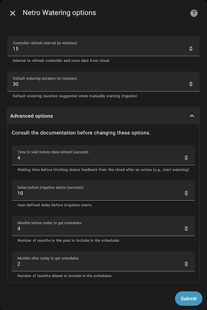
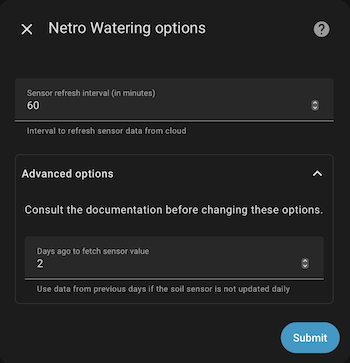

# ha-netro-watering
This is a Home Assistant integration for Netro Smart Garden devices

This custom component allows you to manage the [*Netro*](https://Netrohome.com/) ecosystem, ensuring the automatic watering of the garden, thanks to the controllers and sensors of the brand. It relies on *Netro*'s [Public API](http://www.Netrohome.com/en/shop/articles/10).

It has been developed from Home Assistant 2023.4.0 version.

## Description
The *Netro* controller is connected to the solenoid valves which will each water a particular area of your garden. The maximum number of zones that can be managed depends on the controller model you have. Only the zones actually connected to the solenoid valves can be managed by the *Netro* system and therefore by the integration.

The integration defines three types of devices:

* controllers
* zones controlled by the controllers
* soil sensors that measure the humidity and temperature of the soil as well as the amount of light received

The integration allows you to manage the controllers and all the zones and sensors that are part of your system.
Netro products *Sprite*, *Spark*, *Pixie* and *Whisperer* are actually supported.

## Installation

### From HACS

1. Install HACS if you haven't already (see [installation guide](https://hacs.netlify.com/docs/installation/manual)).
2. Add custom repository "https://github.com/kcofoni/ha-netro-watering.git" as "Integration" in the settings tab of HACS.
3. Find and install "Netro Watering" integration in HACS's "Integrations" tab.
4. Restart your Home Assistant.
5. Add "Netro Watering" integration in Home Assistant's "Configuration -> Integrations" tab.

### Manual

1. Download and unzip the [repo archive](https://github.com/kcofoni/ha-netro-watering/archive/refs/heads/main.zip). (You could also click "Download ZIP" after pressing the green button in the repo, alternatively, you could clone the repo from SSH add-on).
2. Copy contents of the archive/repo into your `/config` directory.
3. Restart your Home Assistant.
4. Add "Netro Watering" integration in Home Assistant's "Configuration -> Integrations" tab.

## Configuration

Please repeat step 4. as mentioned above for each device you want to include, whatever it is a ground sensor, a multi-zone controller (Sprite or Spark) or a single-zone controler (Pixie). Each zone of a controller will be represented by separate device related to the controller it depends on.

At this point, several devices may have been created related to ten's of entity. This latter are representing the humidity, temperature, illuminance of the sensors as well as the current/last/next status of each zone. Switches have been created allowing to start/stop watering and enable/disable controllers.

Options may be changed related to polling refresh interval of sensors and controllers independently. Default watering duration and schedules options may also be changed specifically for the controllers. 

**IMPORTANT: to be effective, each time options have been changed the related device must be reloaded.**

## Running
No dedicated card has been implemented yet but perhaps there will be user contributions in this direction. In the meantime can be displayed in a very classical layout as follows:

The Netro Watering entities may be integrated into automations. The following integration custom services are available:
- **start watering** and **stop watering** services - to be applied to any controller or zone
- **enable** and **disable** services - to be applied to any controller

